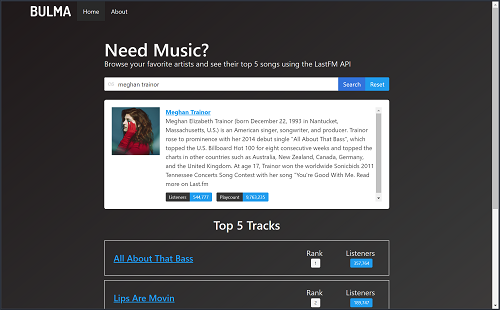

# ngLastFM App - Search for Music and Movies!
This application uses the LastFM API to search musical artists and the TheMovieDB API to search movies to display basic demographical information.  It was developed using **Angular 5**, makes calls to the [LastFM API](https://www.last.fm/api) and the [TheMovieDB API](https://developers.themoviedb.org/3/getting-started/introduction), and styled using the [Bulma CSS Framework](https://bulma.io).

<p align="center">
    <br>
</p>

## Versions
* [Angular CLI](https://github.com/angular/angular-cli) v1.6.7
* Angular v5.2.3
* [Bulma](https://bulma.io) v0.6.2

## Installation
1. Clone this repo `git clone https://github.com/stanleyeosakul/angular-lastfm.git`
1. `cd` into the folder of the cloned repo
1. Run `yarn install` to install dependencies
1. Update the `LastFM API Key`
    * Obtain a free API key from LastFM [here](https://www.last.fm/api)
    * Obtain a free API key from TheMovieDB [here](https://www.themoviedb.org)
    * Go to `api.service.ts` and save your API keys into the file

        ```typescript
        export class LastfmService {

            API_KEY_LASTFM = <your-lastFM-API-key-goes-here>
            API_KEY_THEMOVIEDB = <your-TheMovieDB-API-key-goes-here>

            constructor(private http: HttpClient) { }
        ```
1. Run `ng serve`, and navigate to `http://localhost:4200/`

## Deploying to Heroku
1. Modify the `start` and `postinstall` scripts in `package.json` to:

    ```json
    "scripts": {
        "ng": "ng",
        "start": "node server.js",
        "build": "ng build",
        "test": "ng test",
        "lint": "ng lint",
        "e2e": "ng e2e",
        "postinstall": "ng build --prod"
    },
    ```
2. Move the following dependecies from `devDependencies` to `dependencies` in `package.json`:

    ```json
    "dependencies": {
        ...
        "@angular/cli": "1.6.6",
        "@angular/compiler-cli": "^5.2.2",
        ...
        "typescript": "~2.5.3",
        ...
    },
    ```
5. Deploy to Heroku as directed in their [documentation](https://devcenter.heroku.com/articles/git).
