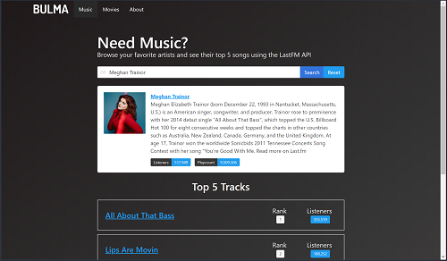

# ngLastFM App
This application uses the LastFM API to search artists and display brief demographic information as well as their top 5 songs.  This project was originally started using the video series [Angular 2 Spotify App](https://www.youtube.com/watch?v=f6SrTZwZi70&list=PLillGF-RfqbYmJsLiPDVoDea3lfy7-E8O) by *Brad Traversy*.  However, the Spotify API now requires authorization and due to this added complexity, this API was abandoned in favor of LastFM's API which is free and easy-to-use.  As the original app was created in 2016 using the Spotify app and Angular 2 RC4, this project has undergone major revisions as it was developed using **Angular 5**, makes calls to the [LastFM API](https://www.last.fm/api), and styled using the [Bulma CSS Framework](https://bulma.io).

<p align="center">
    <br>
    <a href="http://nglastfm.herokuapp.com/" target="_blank">ngLastFM App</a>
</p>

## Versions
* [Angular CLI](https://github.com/angular/angular-cli) v1.6.6
* Angular v5.2.2
* [Bulma](https://bulma.io) v0.6.2

## Installation
1. Clone this repo `git clone https://github.com/stanleyeosakul/angular-lastfm.git`
1. `cd` into the folder of the cloned repo
1. Run `yarn install` to install dependencies
1. Update the `LastFM API Key`
    * Obtain a free API key from LastFM [here](https://www.last.fm/api)
    * Go to `lastfm.service.ts` and save your API Key into the file
        ```typescript
        export class LastfmService {

            API_KEY = <your-lastFM-API-key-goes-here>

            constructor(private http: HttpClient) { }
        ```
1. Run `ng serve`, and navigate to `http://localhost:4200/`

## Deploying to Heroku
1. Modify the `start` and `postinstall` scripts in `package.json` to:
    ```json
    "scripts": {
        "ng": "ng",
        "start": "node server.js",
        "build": "ng build",
        "test": "ng test",
        "lint": "ng lint",
        "e2e": "ng e2e",
        "postinstall": "ng build --prod && ng build --prod --app universal --output-hashing=none"
    },
    ```
2. Move the following dependecies from `devDependencies` to `dependencies` in `package.json`:
    ```json
    "dependencies": {
        ...
        "@angular/cli": "1.6.6",
        "@angular/compiler-cli": "^5.2.2",
        ...
        "typescript": "~2.5.3",
        ...
    },
    ```
5. Deploy to Heroku as directed in their [documentation](https://devcenter.heroku.com/articles/git).